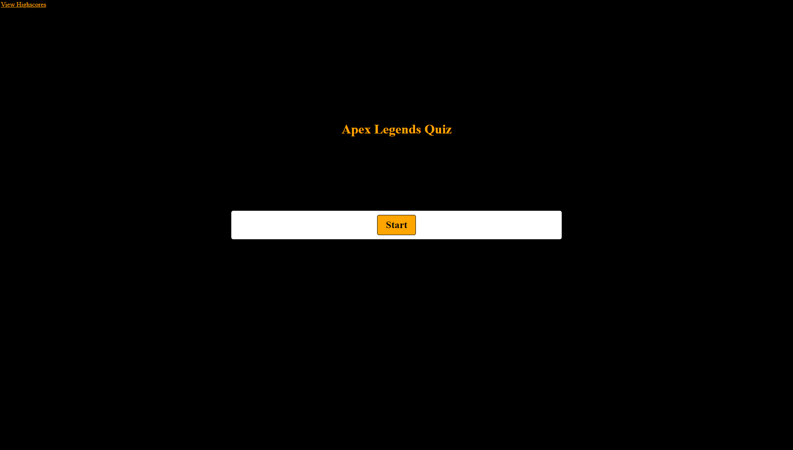

# Timed_Quiz

Description: 

This quiz is designed to test your knowledge of Apex Legends. Once the user starts the game, they will have 60 seconds to answer 5 multiple choice questions about the game. A user's score for the game is determined by the amount of time left on the clock after the final question is answered, and for every wrong answer, the user will have 5 seconds deducted off the clock. After the quiz, the user is prompted to enter their initials to save their score, and is redirected to a highscores page that displays the scores in order from highest to lowest, alongisde that user's initials. From that page, they can go back to the start of the quiz to try again, or clear the highscores list and start from scratch.

Links:

Link to deployed "Start Quiz" page: [Start Quiz Page](https://elijahflanders96.github.io/Timed_Quiz/index.html)
Link to deployed "Highscores" page: [Highscores Page](https://elijahflanders96.github.io/Timed_Quiz/altindex.html)
Usage Instructions:

Click the Start Button to start the quiz

A 60 second timer will start and the user will answer 5 questions
Everytime the user chooses a qrong answer, 5 seconds are deducted from the clock
The quiz ends after the user has answered all the questions or the timer runs out
The score is equal to the amount of time remaining on the timer when the quiz ends
The user can submit their initials to the highscore page, which displays the scores in order of highest to lowest
The user can either choose to go back to the start page or clear the highscores

Credits:

Web Dev Simplified and James Q Quirk's videos helped a lot for this project. Here are the links respectively:
[Web Dev Simplified](https://www.youtube.com/watch?v=riDzcEQbX6k)
[James Q Quirk](https://www.youtube.com/watch?v=jfOv18lCMmw)
Thanks as well to Kylie Schmidt for grueling over this project with me.

